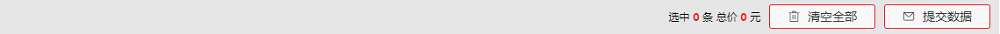
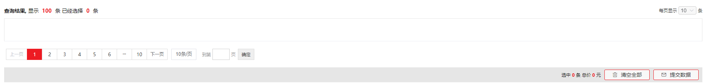
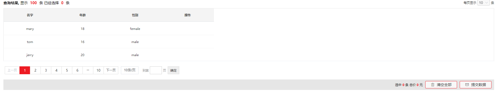
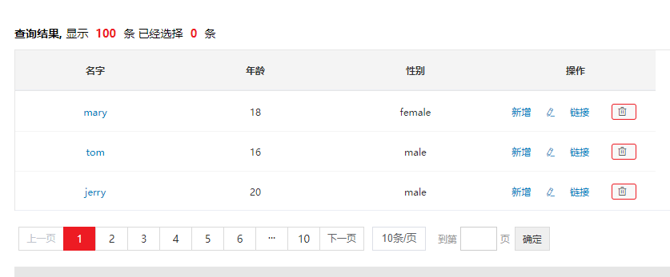
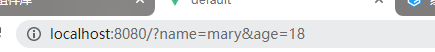
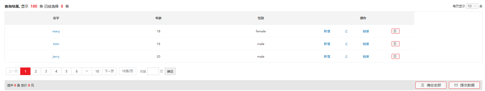
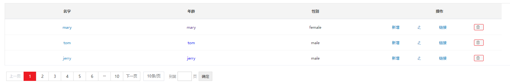

### 1 组合table（ele模板）OYCompositionTable


**完整代码示例：**

```vue
<template>
  <div>
    <OY-composition-table
      ref="ttt"
      show-head
      :head-crumbs="headCrumbs"
      show-foot
      :left="false"
      :foot-crumbs="footCrumbs"
      :footer-operations="footerOperations"
      :current-page="currentPage"
      :total="total"
      :page-size="pageSize"
      :page-sizes="pageSizes"
      :data="tableData"
      :columns="columns"
      row-key="id"
      @operationClick="handleOperationClick"
      @size-change="handlePageSizeChange"
      @current-change="handleCurrentChange"
      @prev-click="handlePrevClick"
      @next-click="handleNextClick"
      @selection-change="handleSelectionChange"
    >
      <template v-slot:expand="{ row }">
        <div style="padding-left: 50px">
          <p>名字:{{ row.name }}</p>
          <p>薪资:{{ row.age }}</p>
          <p>加载: {{ row._expand.name }}</p>
        </div>
      </template>
    </OY-composition-table>
  </div>
</template>
<script>
export default {
  name: 'TableCompositionTable',
  data() {
    return {
      headCrumbs: [['显示', '100', '条'], ['已经选择', '0', '条']],
      footCrumbs: [['选中', '0', '条'], ['总价', '0', '元']],
      footerOperations: [
        // test属性必须，icon属性可选
        { text: '清空全部', icon: 'el-icon-delete' },
        { text: '提交数据', icon: 'el-icon-message' }
      ],
      currentPage: 5,
      total: 100,
      pageSize: 10,
      pageSizes: [10, 20, 30, 40, 50],
      tableData: [
        { id: '001', name: 'mary', age: 18, gender: 'female' },
        { id: '002', name: 'tom', age: 16, gender: 'male' },
        { id: '003', name: 'jerry', age: 20, gender: 'male' }
      ],
      columns: [
        { type: 'selection' },
        { type: 'expand', width: 25,
          remote: (row, i) => {
            return new Promise((resolve, reject) => {
              setTimeout(() => {
                resolve({ name: '成功展开' })
              }, 500)
            })
          }
        },
        {
          label: '名字', prop: 'name', align: 'center', width: '400',
          type: 'link',
          href: ({ row }) => `?name=${row.name}&age=${row.age}`
        },
        {
          label: '年龄', prop: 'age', align: 'center', width: '400', type: 'render',
          render: (h, { row }) => {
            return <div>{row.age}</div>
          }
        },
        {
          label: '性别', prop: 'gender', align: 'center', width: '400'
        },
        {
          label: '操作', type: 'operation', align: 'center', width: '400',
          prop: 'operation',
          operations: [
            { type: 'text', text: '新增' },
            { type: 'icon', icon: 'el-icon-edit' },
            { type: 'link', text: '链接', link: '#/' },
            { type: 'button', props: { type: 'danger', icon: 'el-icon-delete' } }
          ]
        }
      ]
    }
  },
  mounted() {
    this.clearValue()
  },
  methods: {
    clearValue: function clearValue() {
      document.getElementsByClassName('el-pagination__jump')[0].getElementsByClassName('el-pagination__editor')[0].getElementsByClassName('el-input__inner')[0].value = this.currentPage
    },
    handleOperationClick({ row, type, text }, index) {
      console.log(row)
      console.log(index)
      switch (index) {
        case 3: {
          this.tableData = this.tableData.filter(item => item.id !== row.id)
        }
      }
    },
    handlePageSizeChange(val) {
      console.log('分页数' + val)
    },
    handleCurrentChange(val) {
      console.log('当前页码' + val)
    },
    handlePrevClick(val) {
      console.log('上一页页码', val)
    },
    handleNextClick(val) {
      console.log('下一页页码', val)
    },
    handleSelectionChange(checkedData) {
      console.log(checkedData)
    }
  }
}
</script>
```


## 以下为属性分析

### (1)头部属性

**show-head**

为true时允许头部字段出现

**head-crumbs**

表格头部字段，data数据类型为二维数组

```vue
headCrumbs: [['显示','100','条'],['已经选择','0','条']],
```


**渲染效果**


“查询结果， ”是固定输出文本，仅后面内容由数组拆分并析出。


示例：

```vue
<template>
  <OYCompositionTable
      show-head
      :head-crumbs="headCrumbs"
  />
</template>
<script>
  export default {
  name: "TableCompositionTable",
  data() {
    return {
      headCrumbs: [['显示','100','条'],['已经选择','0','条']],
    }
  }
}
</script>
```


### (2)底部属性

**show-foot**

为true时允许底部字段出现

**foot-crumbs**

表格底部字段，data数据类型为二维数组

**left**

为false时，底部数据靠右对齐

```vue
footCrumbs: [['选中','0','条'],['总价','0','元']],
```

**footer-operations**

在底部字段数据后面，追加可交互的button按钮选项。data数据类型为二维数组


示例：

```vue
<template>
  <OYCompositionTable
      show-head
      :head-crumbs="headCrumbs"
      show-foot
      :left="false"
      :foot-crumbs="footCrumbs"
      :footer-operations="footerOperations"
  />
</template>
<script>
export default {
  name: "TableCompositionTable",
  data() {
    return {
      headCrumbs: [['显示', '100', '条'], ['已经选择', '0', '条']],
      footCrumbs: [['选中', '0', '条'], ['总价', '0', '元']],
      footerOperations: [       //test属性必须，icon属性可选
        {text: '清空全部',icon: 'el-icon-delete'},
        {text: '提交数据',icon: 'el-icon-message'}
      ]
    }
  }
}
</script>
```


**渲染效果**




### (3)分页器

**pagination**

默认为true，开启分页渲染

**current-page**

当前页，默认为第一页

**total**

分页总数量

**page-size**

页码

**page-sizes**


示例：

```vue
<template>
  <OYCompositionTable
      show-head
      :head-crumbs="headCrumbs"
      show-foot
      :left="false"
      :foot-crumbs="footCrumbs"
      :footer-operations="footerOperations"
      :current-page="currentPage"
      :total="total"
      :page-size="pageSize"
      :page-sizes="pageSizes"
  />
</template>
<script>
export default {
  name: "TableCompositionTable",
  data() {
    return {
      headCrumbs: [['显示', '100', '条'], ['已经选择', '0', '条']],
      footCrumbs: [['选中', '0', '条'], ['总价', '0', '元']],
      footerOperations: [       //test属性必须，icon属性可选
        {text: '清空全部', icon: 'el-icon-delete'},
        {text: '提交数据', icon: 'el-icon-message'}
      ],
      currentPage: 1,
      total: 100,
      pageSize: 10,
      pageSizes: [10, 20, 30, 40, 50]
    }
  }
}
</script>
```


**渲染效果**




### (4)表单数据

**data**

构成表单内容的必要数据，Array<Object>类型。

对象中的属性名需要跟columns中对应关联起来。

```vue
tableData: [
        {name: 'mary', age: 18, gender: 'female'},
        {name: 'tom', age: 16, gender: 'male'},
        {name: 'jerry', age: 20, gender: 'male'}
],
```


**columns**

构成表头信息的必要数据，Array<Object>类型。

label为展示在页面中的表头标题信息，prop当前列对应data中的对象属性名，align为对齐方式（left、center、right），width为列宽。以上为columns中常用属性。

```vue
columns: [
        {label: '名字', prop: 'name', align: 'center', width: '200',},
        {label: '年龄', prop: 'age', align: 'center', width: '200',},
        {label: '性别', prop: 'gender', align: 'center', width: '200'},
        {label: '操作', type: 'operation', align: 'center', width: 200,}
]
```


**row-key**

每个data对象的id属性，不能重复，出于diff算法需要

```vue
tableData: [
        {id: '001',name: 'mary', age: 18, gender: 'female'},
        {id: '002',name: 'tom', age: 16, gender: 'male'},
        {id: '003',name: 'jerry', age: 20, gender: 'male'}
],
```


示例：

```vue
<template>
  <OYCompositionTable
      show-head
      :head-crumbs="headCrumbs"
      show-foot
      :left="false"
      :foot-crumbs="footCrumbs"
      :footer-operations="footerOperations"
      :current-page="currentPage"
      :total="total"
      :page-size="pageSize"
      :page-sizes="pageSizes"
      :data="tableData"
      :columns="columns"
      row-key="id"
  />
</template>
<script>
export default {
  name: "TableCompositionTable",
  data() {
    return {
      headCrumbs: [['显示', '100', '条'], ['已经选择', '0', '条']],
      footCrumbs: [['选中', '0', '条'], ['总价', '0', '元']],
      footerOperations: [       //text属性必须，icon属性可选
        {text: '清空全部', icon: 'el-icon-delete'},
        {text: '提交数据', icon: 'el-icon-message'}
      ],
      currentPage: 1,
      total: 100,
      pageSize: 10,
      pageSizes: [10, 20, 30, 40, 50],
      tableData: [
        {id: '001',name: 'mary', age: 18, gender: 'female'},
        {id: '002',name: 'tom', age: 16, gender: 'male'},
        {id: '003',name: 'jerry', age: 20, gender: 'male'}
      ],
      columns: [
        {label: '名字', prop: 'name', align: 'center', width: '200',},
        {label: '年龄', prop: 'age', align: 'center', width: '200',},
        {label: '性别', prop: 'gender', align: 'center', width: '200'},
        {label: '操作', type: 'operation', align: 'center', width: 200,}
      ]
    }
  },
}
</script>
```


**渲染效果**




### **(5)特殊配置 type**

#### **1.link 链接样式列数**据

type: 'link'

href: 'http://xxxxxx' 这类固定链接，也可以通过

href: ({row}) => `http://xxx?name=${row.name}&age=${row.age}`	href函数来定义后缀，添加query参数

示例：

```vue
<template>
  <OYCompositionTable
      show-head
      :head-crumbs="headCrumbs"
      show-foot
      :left="false"
      :foot-crumbs="footCrumbs"
      :footer-operations="footerOperations"
      :current-page="currentPage"
      :total="total"
      :page-size="pageSize"
      :page-sizes="pageSizes"
      :data="tableData"
      :columns="columns"
      row-key="id"
      @operationClick="handleOperationClick"
  />
</template>
<script>
export default {
  name: "TableCompositionTable",
  data() {
    return {
      headCrumbs: [['显示', '100', '条'], ['已经选择', '0', '条']],
      footCrumbs: [['选中', '0', '条'], ['总价', '0', '元']],
      footerOperations: [       //test属性必须，icon属性可选
        {text: '清空全部', icon: 'el-icon-delete'},
        {text: '提交数据', icon: 'el-icon-message'}
      ],
      currentPage: 1,
      total: 100,
      pageSize: 10,
      pageSizes: [10, 20, 30, 40, 50],
      tableData: [
        {id: '001',name: 'mary', age: 18, gender: 'female'},
        {id: '002',name: 'tom', age: 16, gender: 'male'},
        {id: '003',name: 'jerry', age: 20, gender: 'male'}
      ],
      columns: [
        {
          label: '名字', prop: 'name', align: 'center', width: '200',
          type: 'link',
          href: ({row}) => `?name=${row.name}&age=${row.age}`
        },
        {label: '年龄', prop: 'age', align: 'center', width: '200',},
        {label: '性别', prop: 'gender', align: 'center', width: '200'},
        {
          label: '操作', type: 'operation', align: 'center', width: 200,
          prop: 'operation',
          operations: [
            {
              type: 'text',
              text: '新增',
            },
            {
              type: 'icon',
              icon: 'el-icon-edit'
            },
            {
              type: 'link',
              text: '链接',
              link: '#/'
            },
            {
              type: 'button',
              props: {
                type: 'danger',
                icon: 'el-icon-delete'
              }
            }
          ]
        }
      ]
    }
  },
}
</script>
```

渲染效果：






#### **2.operation 操作编辑按钮设置**

type: 'operation'

prop: 'operation'

operations: [{type: 'text', text: '新增'}]诸如此类属性

目前已知operations中的type属性有：text、icon、link、button

可编辑按钮可通过**自定义事件“operationClick”**来响应执行

示例：

```vue
<template>
    <OYCompositionTable
        show-head
        :head-crumbs="headCrumbs"
        show-foot
        :left="false"
        :foot-crumbs="footCrumbs"
        :footer-operations="footerOperations"
        :current-page="currentPage"
        :total="total"
        :page-size="pageSize"
        :page-sizes="pageSizes"
        :data="tableData"
        :columns="columns"
        row-key="id"
        @operationClick="handleOperationClick
        @foote-operation-click="footerOperationClick"          
    />
</template>
<script>
export default {
  name: "TableCompositionTable",
  data() {
    return {
      headCrumbs: [['显示', '100', '条'], ['已经选择', '0', '条']],
      footCrumbs: [['选中', '0', '条'], ['总价', '0', '元']],
      footerOperations: [       //test属性必须，icon属性可选
        {text: '清空全部', icon: 'el-icon-delete'},
        {text: '提交数据', icon: 'el-icon-message'}
      ],
      currentPage: 1,
      total: 100,
      pageSize: 10,
      pageSizes: [10, 20, 30, 40, 50],
      tableData: [
        {id: '001',name: 'mary', age: 18, gender: 'female'},
        {id: '002',name: 'tom', age: 16, gender: 'male'},
        {id: '003',name: 'jerry', age: 20, gender: 'male'}
      ],
      columns: [
        {
          label: '名字', prop: 'name', align: 'center', width: '200',
          type: 'link',
          href: ({row}) => `?name=${row.name}&age=${row.age}`
        },
        {label: '年龄', prop: 'age', align: 'center', width: '200',},
        {label: '性别', prop: 'gender', align: 'center', width: '200'},
        {
          label: '操作', type: 'operation', align: 'center', width: 200,
          prop: 'operation',
          operations: [
            {
              type: 'text',
              text: '新增',
            },
            {
              type: 'icon',
              icon: 'el-icon-edit'
            },
            {
              type: 'link',
              text: '链接',
              link: '#/'
            },
            {
              type: 'button',
              props: {
                type: 'danger',
                icon: 'el-icon-delete'
              }
            }
          ]
        }
      ]
    }
  },
  methods: {
    handleOperationClick({row,type,text},index) {
      console.log(row);
      console.log(index);
    },
    footerOperationClick(){
        
    }  
  }
}
</script>
```


**渲染效果**




#### **3.重要的render方法**

每个column对象中都包含一个render方法，可以对当前列数据进行一个初始化编译操作。

示例：

```vue
{
  label: '年龄', prop: 'age', align: 'center', width: '400',
  render: (h, {row}) => {
    const link = `?name=${row.name}&age=${row.age}&gender=${row.gender}`;
    return <a href={link}>{row.name}</a>
  },
},
```

注意

1.type不写属性值，当前列数据的type默认就是render，即可执行render渲染，选中了其他type后render方法失效。

2.render函数中遵循JSX语法，一切需要监听的事件都要通过JSX语法实现。


**渲染效果**




#### 4.popover鼠标移入

type: 'popover',

须新增一个popover对象，Array<Object>类型。对象内对鼠标移入显示内容的编辑方法属性名可以是content或remoteContent

正常显示状态的内容属性名为reference，内置render方法，渲染html结构内容。

支持slot插槽，与popover.content配合使用

示例：

```vue
<template>
  <OYCompositionTable
      ref="ttt"
      show-head
      :head-crumbs="headCrumbs"
      show-foot
      :left="false"
      :foot-crumbs="footCrumbs"
      :footer-operations="footerOperations"
      :current-page="currentPage"
      :total="total"
      :page-size="pageSize"
      :page-sizes="pageSizes"
      :data="tableData"
      :columns="columns"
      row-key="id"
      @operationClick="handleOperationClick"
  >
    <template v-slot:popoverColumn="{ content }">
      <div>前缀，名称：</div>
      <div>{{content.name}}</div>
    </template>
  </OYCompositionTable>
</template>
<script>
export default {
  name: "TableCompositionTable",
  data() {
    return {
      headCrumbs: [['显示', '100', '条'], ['已经选择', '0', '条']],
      footCrumbs: [['选中', '0', '条'], ['总价', '0', '元']],
      footerOperations: [       //test属性必须，icon属性可选
        {text: '清空全部', icon: 'el-icon-delete'},
        {text: '提交数据', icon: 'el-icon-message'}
      ],
      currentPage: 1,
      total: 100,
      pageSize: 10,
      pageSizes: [10, 20, 30, 40, 50],
      tableData: [
        {id: '001', name: 'mary', age: 18, gender: 'female'},
        {id: '002', name: 'tom', age: 16, gender: 'male'},
        {id: '003', name: 'jerry', age: 20, gender: 'male'}
      ],
      columns: [
        {type: 'selection'},
        {
          label: '名字', prop: 'name', align: 'center', width: '400',
          type: 'link',
          href: ({row}) => `?name=${row.name}&age=${row.age}`
        },
        {
          label: '年龄', prop: 'age', align: 'center', width: '400',
          type: 'popover',
          popover: [{
            trigger: 'hover',
            content: '使用render方法',				//content适用于静态字符串
            remoteContent: ({row, index}) => {		//remoteContent适用于需要结合当前数据进行查看显示的
              return new Promise((resolve, reject) => {
                setTimeout(() => {
                  if (index % 2 === 0) {
                    reject(Error('请求出错了'));
                  } else {
                    resolve({name: row.name})
                  }
                }, 500);
              });
            },
            reference: {
              render: (h, {column, index, row}) => <div>{row.age}</div>
            }
          }]
        },
        {
          label: '性别', prop: 'gender', align: 'center', width: '400',
        },
        {
          label: '操作', type: 'operation', align: 'center', width: '400',
          prop: 'operation',
          operations: [
            {
              type: 'text',
              text: '新增',
            },
            {
              type: 'icon',
              icon: 'el-icon-edit'
            },
            {
              type: 'link',
              text: '链接',
              link: '#/'
            },
            {
              type: 'button',
              props: {
                type: 'danger',
                icon: 'el-icon-delete'
              }
            }
          ]
        }
      ]
    }
  },
  methods: {
    handleOperationClick({row, type, text}, index) {
      console.log(row);
      console.log(index);
    }
  },
}
```


#### **5.expand可展开表单**

type: 'expand'，

同样可以设置插槽，配合属性remote来计算原有字段或新增字段，在插槽中输出

注意：remote中加载成功返回的row当中的属性为 _expand，需要与column原属性区分开

**完整代码示例中一提供expand属性使用方式**


### (6) 属性总结

| 参数              | 说明                                                         | 类型            | 默认值                 | 可选值                |
| :---------------- | :----------------------------------------------------------- | :-------------- | :--------------------- | :-------------------- |
| loading-cfg       | 显示当前数据是否处于加载中                                   | Object          | {isShowLoading: false} | {isShowLoading: true} |
| show-head         | 是否允许头部字段出现                                         | Boolean         | false                  | boolean               |
| head-crumbs       | 表格头部字段                                                 | Function        | [ [ ], [ ] ]           | - -                   |
| show-footer       | 是否允许底部字段出现                                         | Boolean         | false                  | boolean               |
| foot-crumbs       | 表格底部字段                                                 | Function        | [ [ ], [ ] ]           | - -                   |
| footer-operations | 表格底部按钮                                                 | Array           | [ { } ]                | - -                   |
| -                 | {text: '', icon: ''}                                         | Object          | - -                    | - -                   |
| current-page      | 当前页                                                       | Number          | - -                    | - -                   |
| total             | 总数量                                                       | Number          | - -                    | - -                   |
| top               | 全选框位置。当column中有对象开启了type: 'selection'时生效    | boolean         | false                  | - -                   |
| page-size         | 每页显示数量                                                 | Number          | - -                    | - -                   |
| page-sizes        | 分页数据                                                     | Array           | - -                    | - -                   |
| data              | 表格数据                                                     | Array           | - -                    | - -                   |
| -                 | bgColor: 'offShelf', // 此参数存在 ，则设置当前行样式        |                 |                        |                       |
| row-key           | 数据id，每个data对象中都有一个id属性                         | number/string   | - -                    | - -                   |
| columns           | 表头                                                         | Array           | - -                    | - -                   |
| -                 | filterPlacement:'red', // 为当前字段下的所有数据设置样式     | string          |                        |                       |
| -                 | type,表头可配置属性，'selection' 'expand' 'render' 'popover' 'operation' 'link' | string          | render                 | - -                   |
| -                 | render，支持JSX语法，为表格数据提供高自由度。（设置其他type后不生效） | Function        | - -                    | - -                   |
| LoadingCfg        | loading配置                                                  | Object          | - -                    | - -                   |
| -                 | isShowLoading                                                | 是否开启loading | false                  | boolean               |
| hover             | 是否开始浮动高亮                                             | Boolean         | false                  | - -                   |
| left              | 底部文字是否居左                                             | Boolean         | true                   | - -                   |


### (7) 事件

| 事件名               | 说明                   | 回调参数        |
| -------------------- | ---------------------- | --------------- |
| operation-click      | 当前行操作按钮点击事件 | 当前对象， 索引 |
| foot-operation-click | 底部按钮按钮点击事件   | 当前对象，索引  |
| size-change          | 每页显示数量           | 页码数量        |
| current-change       | 当前页码切换           | 当前页          |
| size-change          | 页码切换               | 当前页          |
| prev-click           | 上一页                 | 当前页          |
| next-click           | 下一页                 | 当前页          |
| selection-change     | 选中事件               | 选中的条目数据  |
