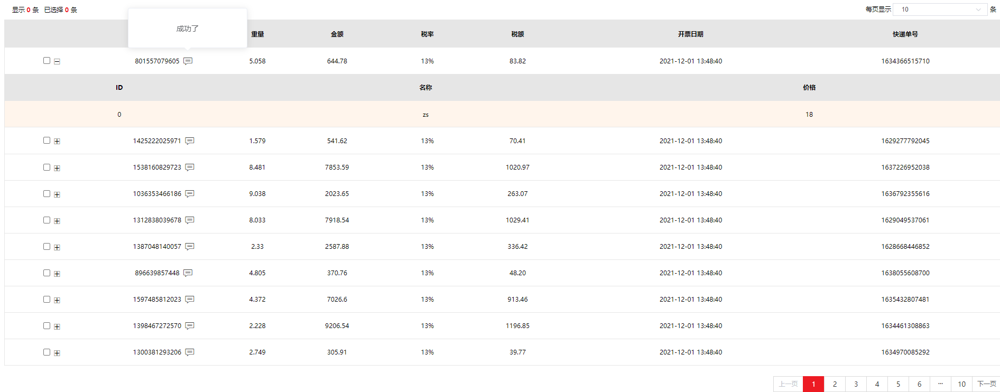

### 2 组合table【原生】

相比ele模板的组合table，原生组合table自由度较低，功能暂未完善，暂不建议使用。


完整代码：

```vue
<template>
  <oy-table-render
    :crumbs="crumbs"
    :pageBox="pageBox"
    :data="list"
    :columns="columns"
    :pageIndex="pageBox.pageIndex"
    :cols="cols"
    @handle-check="handleCheck"
    @handle-check-all="handleCheckAll"
    @handleToggleBtn="handleToggleBtn"
    @prev-click="preClick"
    @next-click="nextClick"
    @current-change="currentChange"
    @handleChangeSelete="handleChangeSelete"
  >
  </oy-table-render>
</template>

<script>
export default {
  name: 'TableRender',
  data() {
    return {
      crumbs: {
        crumbs_btns: [
          { txt: '确认' },
          { txt: '取消' }
        ],
        crumbs_foot: [
          { txt: '选中', num: 0, com: '条' },
          { txt: '总计', num: 0, com: '个' }
        ],
        crumbs_head: [
          { txt: '显示', num: 0, com: '条' },
          { txt: '已选择', num: 0, com: '条' }
        ]
      },
      pageBox: {
        pageIndex: 1,
        pageSize: 10,
        pageSizes: [
          { label: 10, value: 10 },
          { label: 20, value: 20 },
          { label: 30, value: 30 },
          { label: 40, value: 40 },
          { label: 50, value: 50 }
        ],
        total: 100
      },
      list: [
        {
          'num': 801557079605,
          'weight': 5.058,
          'price': 644.78,
          'taxRate': 0.13,
          'BillingDate': 1638337720005,
          'expressNum': 1634366515710,
          'expressType': 1,
          'children': [{ 'id': 0, 'name': 'zs', 'age': 18 }]
        }, {
          'num': 1425222025971,
          'weight': 1.579,
          'price': 541.62,
          'taxRate': 0.13,
          'BillingDate': 1638337720005,
          'expressNum': 1629277792045,
          'expressType': 2,
          'children': [{ 'id': 0, 'name': 'zs', 'age': 18 }]
        }, {
          'num': 1538160829723,
          'weight': 8.481,
          'price': 7853.59,
          'taxRate': 0.13,
          'BillingDate': 1638337720005,
          'expressNum': 1637226952038,
          'expressType': 2,
          'children': [{ 'id': 0, 'name': 'zs', 'age': 18 }]
        }, {
          'num': 1036353466186,
          'weight': 9.038,
          'price': 2023.65,
          'taxRate': 0.13,
          'BillingDate': 1638337720005,
          'expressNum': 1636792355616,
          'expressType': 1,
          'children': [{ 'id': 0, 'name': 'zs', 'age': 18 }]
        }, {
          'num': 1312838039678,
          'weight': 8.033,
          'price': 7918.54,
          'taxRate': 0.13,
          'BillingDate': 1638337720005,
          'expressNum': 1629049537061,
          'expressType': 2,
          'children': [{ 'id': 0, 'name': 'zs', 'age': 18 }]
        }, {
          'num': 1387048140057,
          'weight': 2.33,
          'price': 2587.88,
          'taxRate': 0.13,
          'BillingDate': 1638337720005,
          'expressNum': 1628668446852,
          'expressType': 5,
          'children': [{ 'id': 0, 'name': 'zs', 'age': 18 }]
        }, {
          'num': 896639857448,
          'weight': 4.805,
          'price': 370.76,
          'taxRate': 0.13,
          'BillingDate': 1638337720005,
          'expressNum': 1638055608700,
          'expressType': 3,
          'children': [{ 'id': 0, 'name': 'zs', 'age': 18 }]
        }, {
          'num': 1597485812023,
          'weight': 4.372,
          'price': 7026.6,
          'taxRate': 0.13,
          'BillingDate': 1638337720006,
          'expressNum': 1635432807481,
          'expressType': 1,
          'children': [{ 'id': 0, 'name': 'zs', 'age': 18 }]
        }, {
          'num': 1398467272570,
          'weight': 2.228,
          'price': 9206.54,
          'taxRate': 0.13,
          'BillingDate': 1638337720006,
          'expressNum': 1634461308863,
          'expressType': 1,
          'children': [{ 'id': 0, 'name': 'zs', 'age': 18 }]
        }, {
          'num': 1300381293206,
          'weight': 2.749,
          'price': 305.91,
          'taxRate': 0.13,
          'BillingDate': 1638337720006,
          'expressNum': 1634970085292,
          'expressType': 3,
          'children': [{ 'id': 0, 'name': 'zs', 'age': 18 }]
        }],
      columns: [
        { expand: true, type: 'selection' },
        {
          key: 'num', title: '发票号', width: 240, type: 'popover',
          popover: {
            trigger: 'hover',
            customContent: '<i class="iconfont icon-duanxin icon-popover"></i>',
            placement: 'top',
            width: 200,
            remote: (row, i) => {
              return new Promise((resolve, reject) => {
                resolve('成功了')
              })
            }
          }
        },
        {
          title: '重量', width: 80,
          render: (h, { row }) => <span>{row.weight}</span>
        },
        {
          title: '金额',
          formater: row => row.price
        },
        {
          title: '税率',
          formater: row => (row.taxRate * 100) + '%'
        },
        {
          title: '税额',
          formater: row => (row.price * row.taxRate).toFixed(2)
        },
        {
          title: '开票日期',
          formater: row => {
            let date = new Date(row.BillingDate)
            let obj = {}
            obj.y = date.getFullYear()
            obj.m = date.getMonth() + 1
            obj.d = date.getDate()
            obj.h = date.getHours()
            obj.mi = date.getMinutes()
            obj.s = date.getSeconds()
            for (const k in obj) {
              if (obj[k].toString().length === 1) {
                obj[k] = '0' + obj[k]
              }
            }
            const { y, m, d, h, mi, s } = obj
            return y + '-' + m + '-' + d + ' ' + h + ':' + mi + ':' + s
          }
        },
        {
          title: '快递单号',
          formater: row => row.expressNum
        }
      ],
      cols: [
        {
          'title': 'ID',
          'key': 'id'
        },
        {
          'title': '名称',
          'formater': row => row.name
        },
        {
          'title': '价格',
          'render': (h, { row }) => {
            return <span>{row.age}</span>
          }
        }
      ]
    }
  },
  methods: {
    handleCheck(checkedData) {
      console.log(checkedData)
    },
    handleCheckAll(allData) {
      console.log(allData)
    },
    handleToggleBtn(row, index) {
      console.log(row)
      console.log(index)
    },
    preClick(page) {
      console.log(page)
    },
    nextClick(page) {
      console.log(page)
    },
    currentChange(page) {
      console.log(page)
    },
    handleChangeSelete(number) {
      console.log(number)
    }
  }
}
</script>
```


## 以下为属性分析

**crumbs**

表格上下部分面包屑字段，Object类型

4个属性，title、crumbs_haed、crumbs_foot、crumbs_btns，对应左上角标题开头、头部内容展示、底部内容展示、底部按钮


**pageBox**

对分页器全部属性的集成封装，内置属性：

pageIndex : number、

pageSize : number、

total : number、

pageSizes : Array [ Object { label: number, value : number } ]


**data**

表单数据，Array<Object>类型。


**columns**

表头数据，Array<Object>类型。

key: '表单数据单个属性名'，在没有配置特殊的type时，表格数据默认为key的值。

formater: (row)  => return Promise

返回一个自定义字符串，可根据现有组件使用。类似于组合table的render，但不支持JSX。

render: (h, { row }) => return JSX

返回一个html结构，函数体内支持JSX

type: string，'selection' '', 'popvoer'

title: string，表头标题

width : number


columns内属性**popover** : Object

trigger: string,

customContent: string,

placement: string,

width: number

remote: (row, i) => return Pomise

在鼠标移入时弹窗，触发元素为customContent中写入的HTML字符串格式的元素，展示内容为remote。


**cols**

cols: Array<Object>类型。

Object属性与columns基本一致，title提供表头名称，key或formater渲染字段，渲染依据在于data中各个元素对象需要存在一个children数组，用于向二级表格提供数据。


**渲染效果**




### 属性

| 参数      | 说明         | 类型   | 默认值 | 可选值 |
| :-------- | :----------- | :----- | :----- | :----- |
| crumbs    | 表格上下字段 | Object | {}     | - -    |
| pageBox   | 分页数据     | Object | - -    | - -    |
| columns   | 表头         | Array  | [ ]    | - -    |
| data      | 表格数据     | Array  | - -    | - -    |
| cols      | 二级表格数据 | Array  | - -    | - -    |
| pageIndex | 当前页       | Number | - -    | - -    |

​																																																																																																																		


### **事件**

| 事件名             | 说明                 | 回调参数         |
| :----------------- | :------------------- | :--------------- |
| handle-check       | 单选事件             | 当前对象         |
| handle-check-all   | 全选事件             | 选中的所有条目   |
| handleToggleBtn    | 当前行的展开收起事件 | 当前行数据, 索引 |
| prev-click         | 上一页               | 当前页           |
| next-click         | 下一页               | 当前页           |
| current-change     | 页码切换             | 当前页           |
| handleChangeSelete | 页码数量选择         | 页码数量         |
| handle-clickbtn    | 底部按钮操作事件     | 索引, index      |
| operationClick     | 操作栏点击事件       | row , item       |
